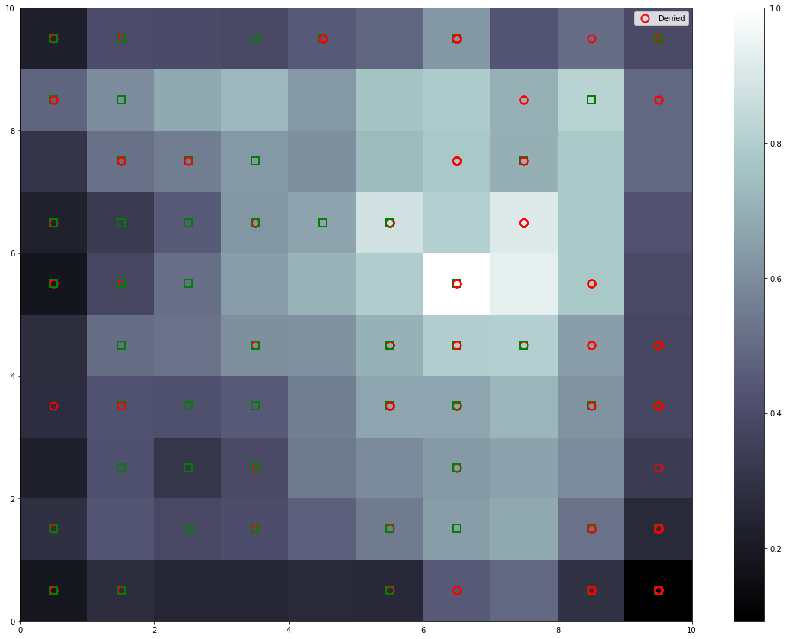

# Deep-learning
This repository contains some Python programs that implement different Deep Learning techniques.
Some of the program has been done following the online course on udemy Deep Learning A-Z™: Hands-On Artificial Neural Networks:

https://www.udemy.com/deeplearning/

In particular, right now the following programs are present:

* ANN Clients Bank:

* Cat-Dog CNN:

* LSTM Stock Price:

* SOM:

  The programs is implemented in Python 3 using MiniSom implementation. The program use Australian Credit Approval data to find frauds thanks using Self Organizing Maps
  
   
  
