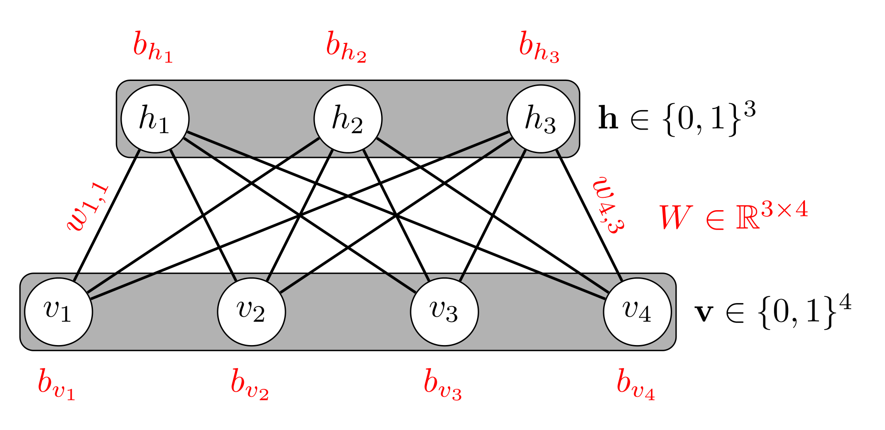

In this notebook we will create a Recommender System for movies using a Restricted Boltzman Machine. 
The Restricted Boltzman Machine is a Generative Model, with undirectional edges, composed of visible and hidden nodes.
We can see the structure of the network in this picture:

In particular, in this model we will use the following datasets:

https://grouplens.org/datasets/movielens/1m/

https://grouplens.org/datasets/movielens/100k/

MovieLens data sets were collected by the GroupLens Research Project
at the University of Minnesota.
 
This data set consists of:
 * 100,000 ratings (1-5) from 943 users on 1682 movies. 
 * Each user has rated at least 20 movies. 
 * Simple demographic info for the users (age, gender, occupation, zip)

Requirements:
 * python 3
 * pytorch
 * numpy
 * pandas
